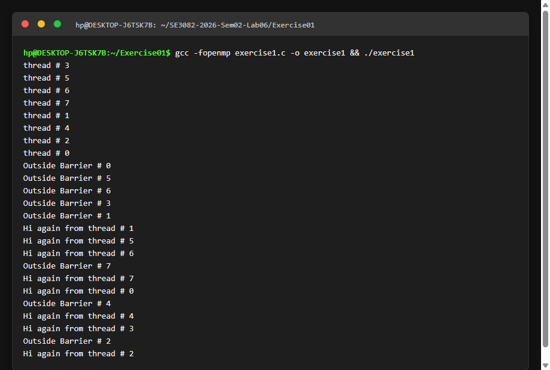
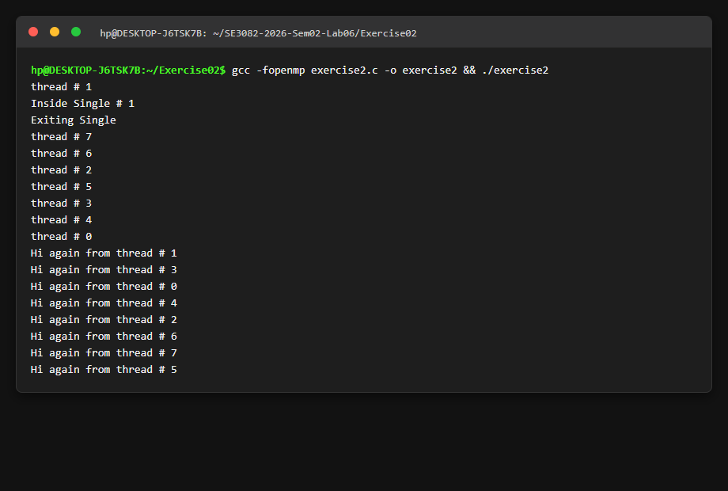
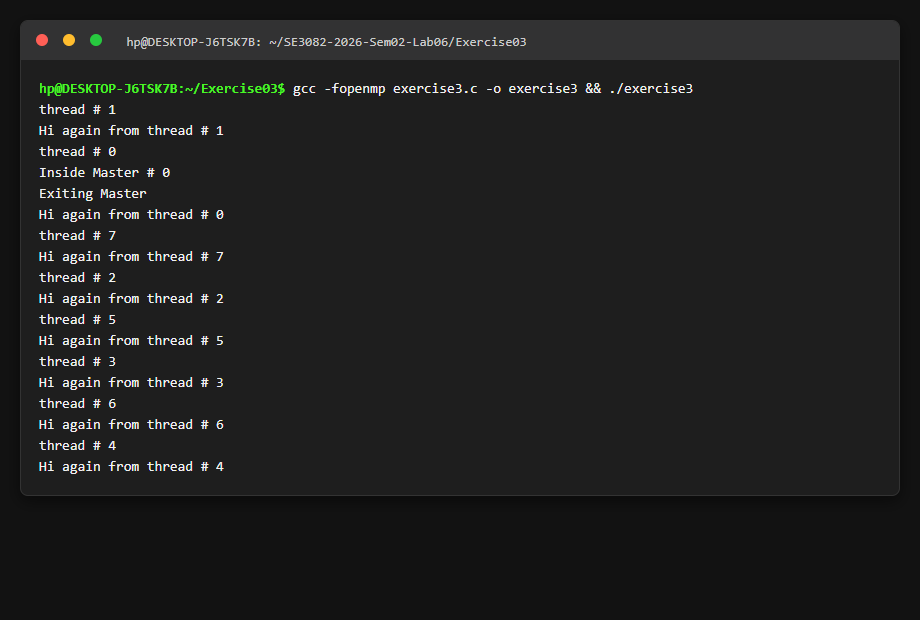
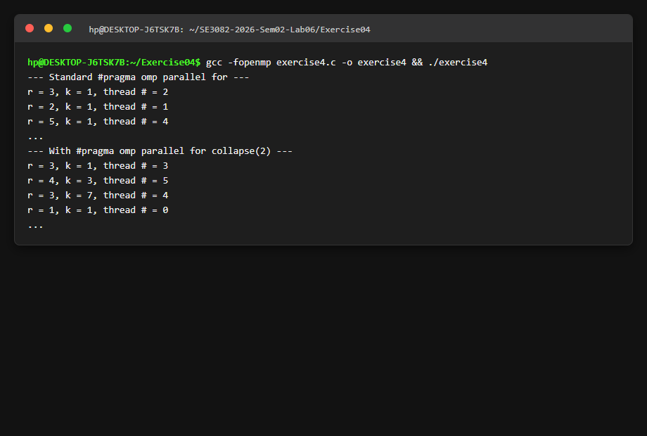
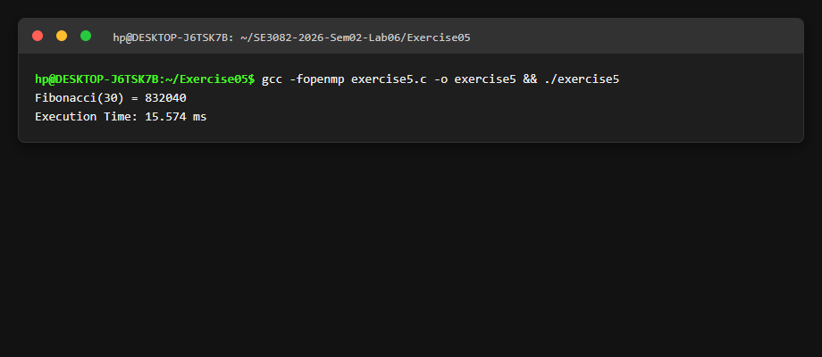
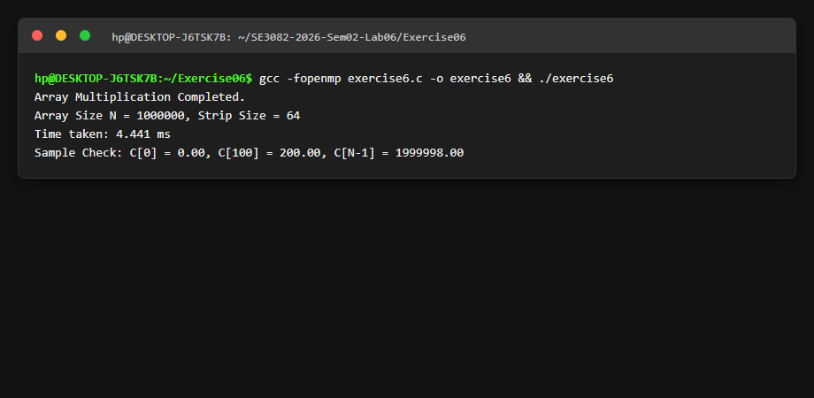
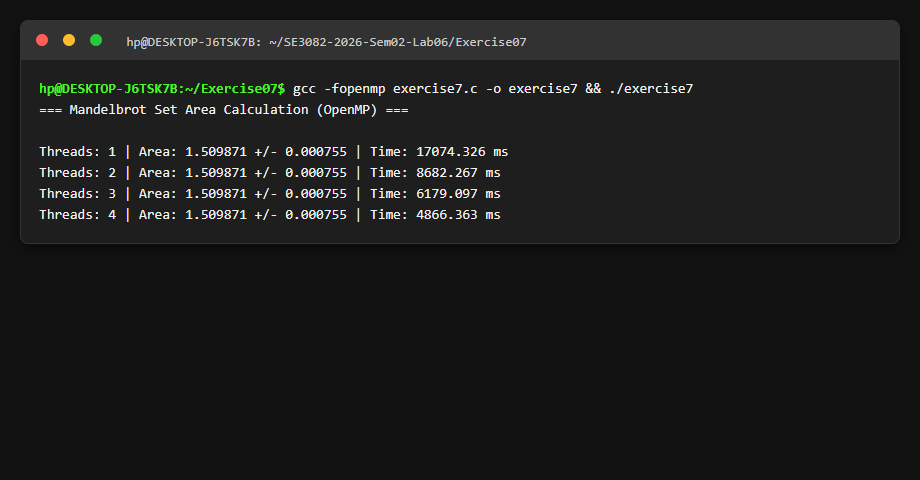

# LAB REPORT: LAB 05 - OPENMP PARALLEL PROGRAMMING

**Student Name / Index Number:** IT24103470  
**Course:** SE3082 - Parallel and Distributed Computing  
**Repository:** [it24103470/SE3082-2026-Sem02-Lab06](https://github.com/it24103470/SE3082-2026-Sem02-Lab06)  

---

## Exercise 1: OpenMP Barrier Directive (`#pragma omp barrier`)

### Code: `Exercise01/exercise1.c`
### Terminal Output Screenshot

### Explanation
`#pragma omp barrier` acts as an explicit synchronization point. All threads in the parallel team must reach the barrier directive before *any* thread is allowed to proceed beyond it.

---

## Exercise 2: OpenMP Single Directive (`#pragma omp single`)

### Code: `Exercise02/exercise2.c`
### Terminal Output Screenshot

### Explanation
`#pragma omp single` specifies that the enclosed block is executed by **only one** thread in the team. Other threads wait at an *implicit barrier* at the end of the single block before continuing.

---

## Exercise 3: OpenMP Master Directive (`#pragma omp master`)

### Code: `Exercise03/exercise3.c`
### Terminal Output Screenshot

### Explanation
`#pragma omp master` forces the block to be executed **exclusively by the master thread (thread 0)** without any implicit barrier at the end.

---

## Exercise 4: Parallel Loop & `collapse(2)` Clause

### Code: `Exercise04/exercise4.c`
### Terminal Output Screenshot

### Explanation
Without `collapse(2)`, only the outer loop `r=1..5` is parallelized. With `collapse(2)`, OpenMP flattens the two loops into 50 iteration pairs $(r,k)$ and distributes all 50 iterations across all threads.

---

## Exercise 5: Fibonacci Task Parallelization

### Code: `Exercise05/exercise5.c`
### Terminal Output Screenshot

---

## Exercise 6: Element-Wise Array Multiplication using Strip Mining

### Code: `Exercise06/exercise6.c`
### Terminal Output Screenshot

---

## Exercise 7: Area of the Mandelbrot Set & Benchmarks

### Code: `Exercise07/exercise7.c`
### Terminal Output Screenshot

### Speedup Analysis Table
| Threads | Execution Time | Speedup Factor | Area Result |
|---|---|---|---|
| **1 Thread** | 17074.326 ms | 1.00x | **1.509871** |
| **2 Threads** | 8682.267 ms | **1.96x** | **1.509871** |
| **3 Threads** | 6179.097 ms | **2.76x** | **1.509871** |
| **4 Threads** | 4866.363 ms | **3.51x** | **1.509871** |
